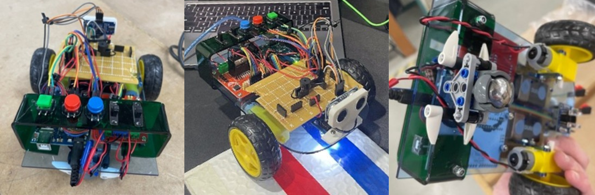

# Hospital Medicine Delivery Robot 🤖💊

 



This project is a prototype of a line-following medicine delivery robot built using an Arduino Uno, RGB sensors, DC motors, and ultrasonic sensors. It was created as a high school systems engineering project to address hospital staff shortages and improve efficiency in medicine delivery.

## Demo Videos

- [Evaluation Video 1 – Line Following](#)
- [Evaluation Video 2 – Obstacle Avoidance](#)
- [Evaluation Video 3 – Transport Test](#)

_(Replace `#` with YouTube or Google Drive links)_

---

## Project Overview

During COVID-19, hospital staff were stretched thin. This robot was designed to:
- Deliver medicine and equipment across hospital wards
- Reduce the burden of minor tasks on nurses
- Navigate autonomously using colour-based line detection
- Avoid obstacles with ultrasonic sensors

---

## System Components

| Component | Purpose |
|----------|---------|
| **Arduino Uno** | Core microcontroller |
| **TCS230 Color Sensor** | Detects coloured lines for navigation |
| **HC-SR04 Ultrasonic Sensor** | Obstacle avoidance |
| **L298N Motor Driver** | Controls dual DC motors |
| **DC Motors with Wheels** | Movement |
| **RGB LED & Buzzer** | User feedback and status |
| **Force Sensor** | Detects object placement |

---

## Program Flow

1. Detect button press (room selection)
2. Read line colour with TCS230 sensor
3. Follow coloured line using motor logic
4. Slow/stop when obstacles are detected
5. Beep and light feedback on departure/arrival

---

## Project Structure

```bash
Hospital-Medicine-Delivery-Robot/
│
├── Firmware/                       # Arduino code
│   └── Firmware.ino/               # Main Arduino code for IDE (open this file)
├── Images/                         # Images of the robot
├── Report/                         # Final Report, evaluation
├── Resources/                      # System diagram, PCB layout, production plan
├── TCS230_Frequency/               # Calibration code for Colour Sensor (TCS230)
└── Testing/                        # Diagnostic journal, risk assessment

```

---

## Testing & Evaluation

The robot was evaluated for:
- **Line following** accuracy
- **Obstacle detection** responsiveness
- **Transport capability** (limited prototype stage)
- **Looping behavior** (issues with loop lock fixed via code suggestions)

Improvements discussed include:
- Nested loops for proper logic transitions
- Additional sensors for destination detection
- NFC or colour-coded stop zones
- Improved object holder design

---

## Lessons Learned

- Importance of modular code for debugging
- Arduino loop management using nested control structures
- Balancing hardware limitations with creative solutions
- Real-world applicability and constraints in healthcare tech

---

*Created as a high school Systems Engineering capstone project.*
